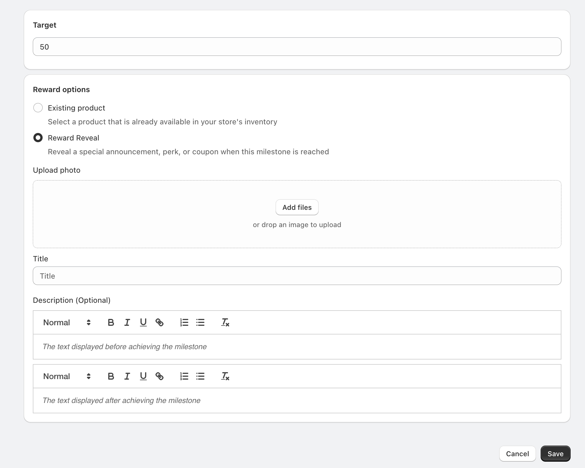
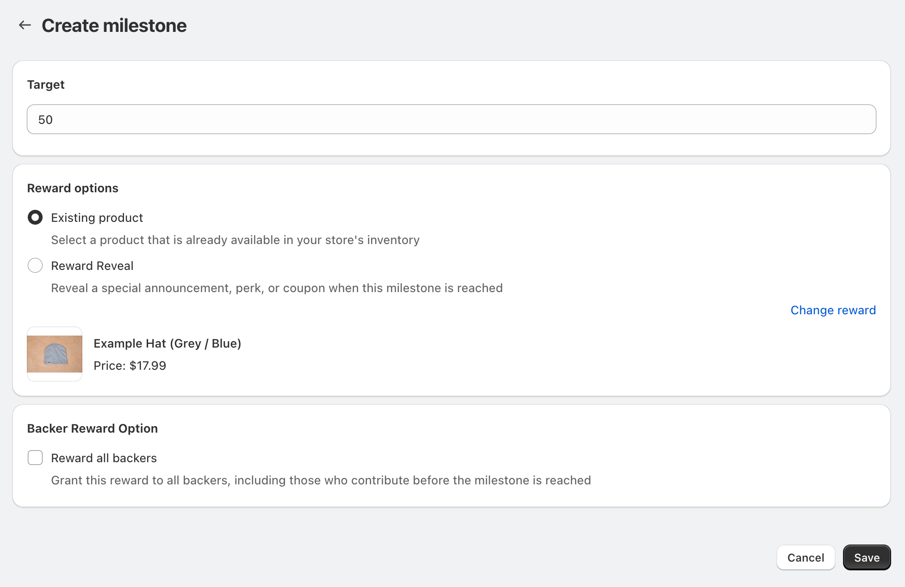

# 🏆 Milestones

### Creating Milestones

To set up a milestone for your campaign:

1. Navigate to your campaign's milestone section
2. Click "Create milestone"

#### Setting the Target

Enter the target number that will trigger your milestone. This can be:

* A number of units sold (for unit-based campaigns)
* An amount raised (for money-based campaigns)

<figure><figcaption>
Set achievable targets that create excitement and momentum in your campaign.
</figcaption></figure>

#### Choosing Reward Options

Select one of two reward types:

1. **Existing Product**
   * Choose a product from your store's inventory
   * Perfect for offering physical rewards
   * Selected product will be automatically added to qualifying orders
2. **Reward Reveal**
   * Announce special perks or future benefits
   * Reveal exclusive content or announcements
   * Share coupon codes or special offers

When using Reward Reveal, you can:

* Upload a photo to represent the reward or milestone
* Add a title for your milestone
* Write descriptions for before and after the milestone is reached

<figure><figcaption></figcaption></figure>

#### Backer Reward Options

Configure who receives the milestone reward:

* **Reward all backers**: Everyone who supported the campaign gets the reward, including those who contributed before the milestone was reached
* **New backers only**: Only supporters who back after the milestone is achieved receive the reward

<figure><figcaption>
Backer reward options allowing you to choose between rewarding all backers or only new ones. Consider your campaign strategy when making this choice.
</figcaption></figure>

### Best Practices

1. Set Strategic Targets
   * Make early milestones achievable to build momentum
   * Space milestones evenly throughout your campaign
   * Align targets with your overall campaign goal
2. Choose Compelling Rewards
   * Ensure reward value matches the milestone's significance
   * Consider your fulfillment capabilities
   * Make rewards relevant to your campaign theme
3. Use Clear Descriptions
   * Write engaging "before" text to build anticipation
   * Create exciting "after" text to celebrate achievement
   * Keep descriptions concise and clear

### Managing Milestones

* Monitor milestone progress in your campaign dashboard
* Update milestone details as needed
* Track reward fulfillment for achieved milestones


Pro tip: Use milestones to create multiple moments of excitement throughout your campaign, encouraging backers to share and promote your campaign as they work toward the next goal.

