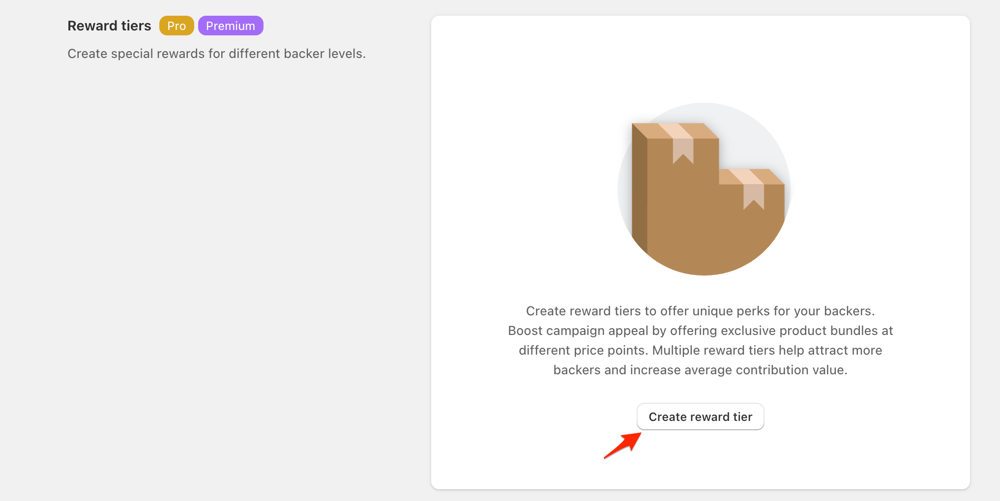
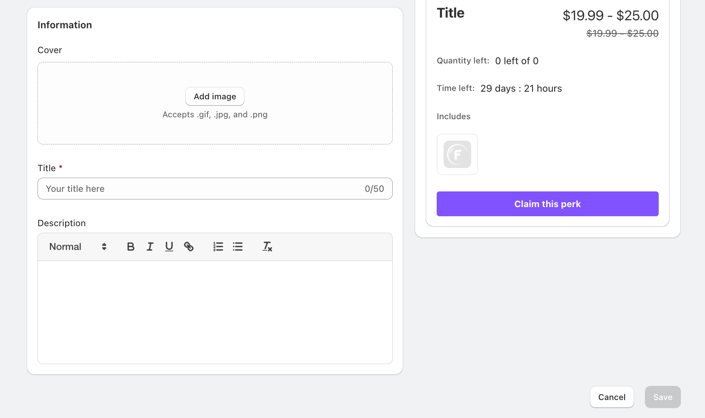
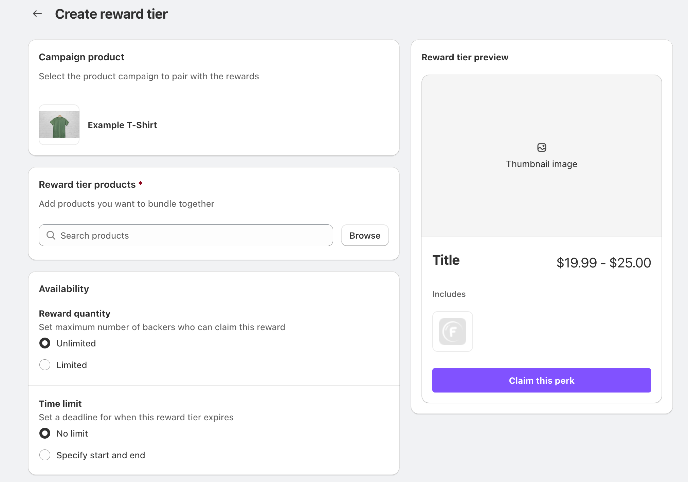
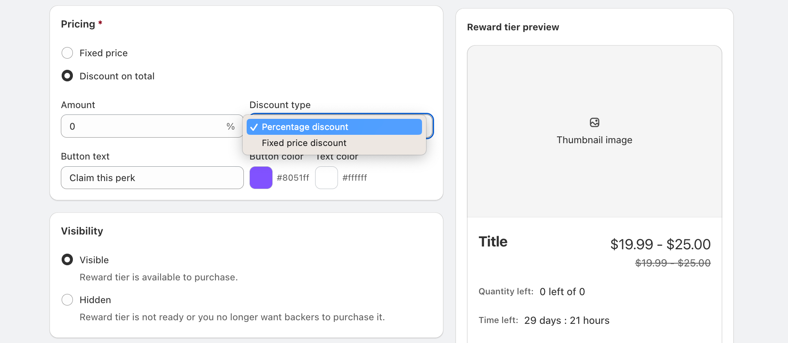
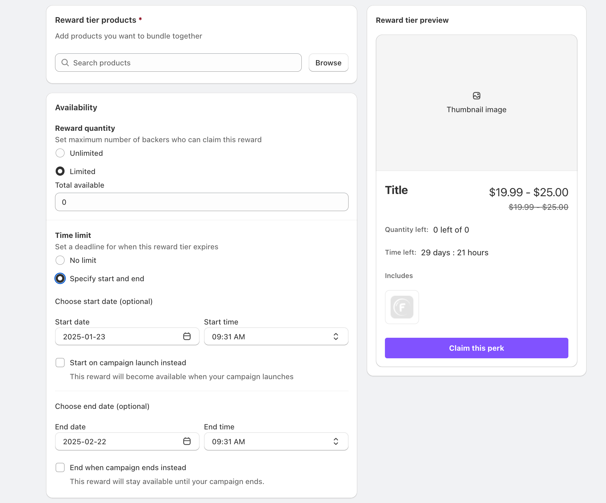
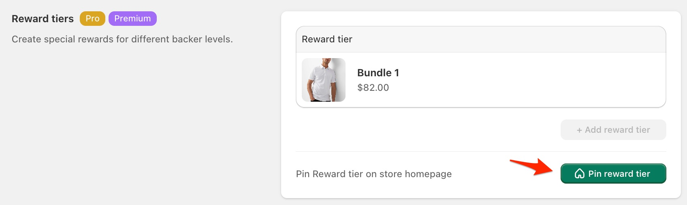

# 📈 Reward tiers


Reward tiers are currently only available for the "Order now" type of campaign


<figure><figcaption>
Reward bundles can boost campaign appeal and increase backer contributions. Find them in the campaign creation form.
</figcaption></figure>

### Creating a Reward Tier

To set up a reward tier for your campaign:

1. Select your campaign product
   * Choose the main product to associate with the reward tier
   * This serves as the base for your bundle
2. Add reward information:
   * Upload a cover image (supports .gif, .jpg, and .png)
   * Add a title (50 character limit)
   * Write a compelling description using the rich text editor

<figure><figcaption>
Control whether your reward tier is visible to backers. Hide tiers temporarily for upcoming special offers or when they're no longer available. You can easily toggle visibility without deleting the tier.
</figcaption></figure>

#### Reward Tier Products

Add products to create your bundle:

* Search or browse your store's inventory
* Select products to include
* Bundle can contain multiple items


**Note:** Some products may not be available for selection in reward tiers due to the following reasons:

1. The product is out of stock
2. The product is still in draft status (not published)
3. The product is already active in another campaign
4. The product doesn't have at least one variant (Create a "Default" variant if needed)

If you don't see a product you're looking for when creating reward tiers, check these conditions to resolve the issue.


<figure><figcaption>
Browse or search your store's products to create compelling bundles. Pro tip: Start typing a product name in the search bar for quick product selection.
</figcaption></figure>

#### Pricing Options

Configure how your reward tier is priced:

1. Choose your pricing model:
   * Fixed price: Set a specific price for the bundle
   * Discount on total: Apply a percentage or fixed discount to the bundle
2. Customize the purchase button:
   * Set button text (default: "Claim this perk")
   * Choose button and text colors to match your brand

<figure><figcaption></figcaption></figure>

#### Availability Settings

Control access to your reward tier:

1. Reward Quantity
   * Unlimited: No restriction on number of backers
   * Limited: Set a maximum number of available spots
2. Time Limit
   * No limit: Available throughout the campaign
   * Specify start and end: Set custom availability window
   * Options to align with campaign timing:
     * Start on campaign launch
     * End when campaign ends

<figure><figcaption>
Fine-tune your reward tier's availability with quantity limits and time windows. Use these settings strategically - limited quantities can create urgency, while custom time windows are perfect for early-bird or flash offers.
</figcaption></figure>

#### Visibility

Manage when backers can see your reward tier:

* Visible: Reward tier is available for purchase
* Hidden: Temporarily hide the tier (useful for upcoming or expired rewards)

### Best Practices

1. Creating Attractive Tiers
   * Offer clear value progression between tiers
   * Include exclusive items or perks
   * Make descriptions clear and compelling
2. Pricing Strategy
   * Set logical price increments between tiers
   * Ensure discounts are attractive but sustainable
   * Consider your profit margins
3. Managing Availability
   * Use limited quantities to create urgency
   * Set strategic time windows for special offers
   * Keep track of remaining spots

### Homepage and Bundle Display

You can display reward tiers directly on your homepage and bundle product pages, increasing visibility and conversion opportunities:

* **Homepage Display**: Showcase selected reward tiers on your store's homepage to attract immediate attention
* **Bundle Product Pages**: Display relevant reward tiers on bundle product pages
* **Confirmation Dialog**: A confirmation prompt appears when pinning reward tiers to ensure intentional changes

<figure><figcaption>
Pin reward tiers to your homepage to drive immediate conversion from your store's most visited page
</figcaption></figure>


This option will be visible for saved campaigns only


### Managing Reward Tiers

* Monitor tier performance in your campaign dashboard
* Adjust availability and visibility as needed
* Track fulfillment requirements for each tier


Pro tip: Create 3-4 tiers with distinct value propositions to appeal to different backer budgets and commitment levels.


### Variant-Specific Images

Help backers choose exactly what they want by showing the correct image for each product variant included in a tier.

1. When adding products to your tier, select a product with variants (e.g., color, size)
2. For each variant, upload or map the specific image you want to display
3. Preview the tier to confirm the right image appears when variants change

<figure><figcaption>
Variant images mapping UI within the Reward Tier editor
</figcaption></figure>

### Display Layouts: Grid or List

Choose the layout that best fits your theme and content density. You can also adjust alignment for a balanced look.

* Grid: Compact card layout, ideal for multiple tiers side-by-side

* List: Spacious vertical layout with larger descriptions

* Alignment: Control content alignment (left, center) per layout

How to configure:

1. Open your Reward Tier settings
2. Select Grid or List layout
3. Adjust alignment to match your store aesthetic

<figure><figcaption>
Layout selector showing Grid/List with alignment options
</figcaption></figure>

### Translations for Reward Tiers

All customer-facing text for Reward Tiers supports translations. Translate tier names, descriptions, and bundle information so international customers read content in their language.

Steps:

1. Go to Settings → Translation
2. Locate the Reward Tiers section
3. Enter translations for each text field

See also: [Translation](../customizations/translation.md)

<figure><figcaption>
Translation settings filtered on Reward Tiers keys
</figcaption></figure>

### Premium Add-to-Cart Experience

When a backer adds a Reward Tier to cart, a modern cart modal appears with a smooth ~0.8s fade-in animation. This provides a polished, consistent shopping experience.

Notes:

* Works automatically when adding tier items to cart
* No configuration required
* Compatible with both Grid and List tier layouts

<figure><figcaption>
Cart modal overlay shown after adding a Reward Tier
</figcaption></figure>
