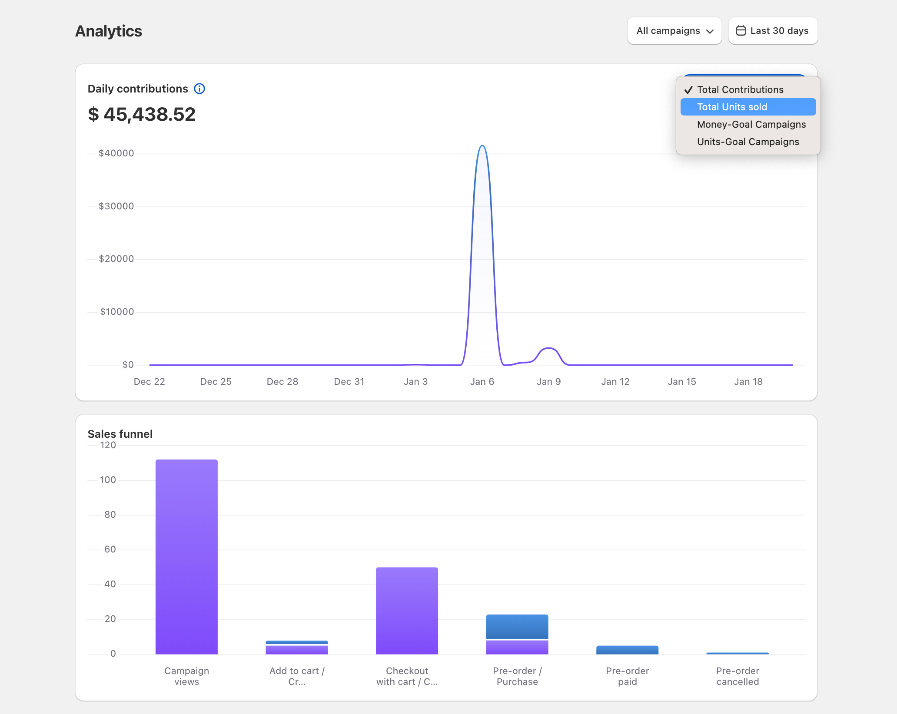

# 📊 Campaign Analytics

### Performance Metrics

#### Daily Contributions

Track your campaign's financial performance over time with multiple viewing options:

1. **Total Contributions**
   * Monitor overall money raised
   * Track daily contribution patterns
   * Identify peak funding periods
2. **Total Units Sold**
   * Track product sales volume
   * View daily sales patterns
3. **Campaign Type Filtering**
   * Money-Goal Campaigns
   * Units-Goal Campaigns

<figure><figcaption>
Analytics dashboard showing a daily contributions graph with filter options. Use the dropdown menu on the right to switch between different metrics and understand your campaign's performance from multiple angles.
</figcaption></figure>

#### Sales Funnel Analysis

Understand your conversion journey through detailed funnel metrics:

1. **Campaign Views**
   * Total number of campaign page visits
   * Initial exposure metric
2. **Add to Cart/Crowdfund**
   * Visitors who initiated backing process
   * First step conversion rate
3. **Checkout with Cart/Crowdfund**
   * Number of checkout initiations
   * Mid-funnel conversion metric
4. **Pre-order/Purchase**
   * Completed order placements
   * Key conversion point
5. **Pre-order Paid**
   * Successfully processed payments
   * Final conversion metric
6. **Pre-order Cancelled**
   * Tracking of cancelled orders
   * Campaign health indicator

### Using the Analytics Dashboard

#### Time Period Selection

* Choose your analysis timeframe (default: Last 30 days)
* Compare different periods
* Track campaign progress over time

#### Campaign Selection

* View metrics for all campaigns or individual ones
* Filter by campaign type
* Focus on specific performance periods

### Making Data-Driven Decisions

Use these analytics to:

* Identify successful campaign strategies
* Optimize conversion points
* Time campaign updates and promotions
* Understand backer behavior patterns


Pro tip: Monitor the relationship between campaign views and successful conversions to identify opportunities for optimization at each funnel stage.

