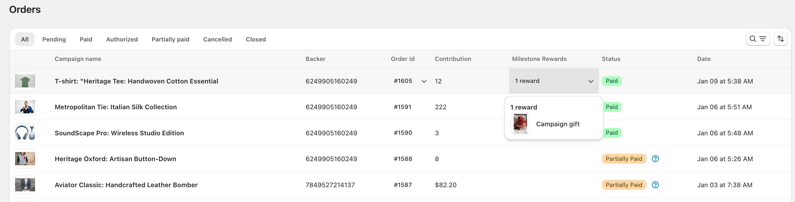

# 🛒 Orders

### Understanding Order Statuses

Orders can have the following statuses:

* **Pending**: Orders awaiting processing or payment
* **Paid**: Successfully completed orders
* **Authorized**: Pre-orders with authorized payment
* **Partially paid**: Pre-orders awaiting final payment
* **Cancelled**: Orders that have been cancelled
* **Closed**: Completed and archived orders

### Order List Overview

The order list displays key information for each transaction:

#### Essential Information

* Campaign name and product image
* Backer ID
* Order ID (e.g., #1605)
* Contribution amount
* Milestone rewards
* Status
* Date and time of order

<figure><figcaption>
Orders page showing a list of orders with various statuses. The list displays comprehensive order information including campaign details, order contribution, and milestone rewards.
</figcaption></figure>

### Order Management Features

#### Filtering Orders

Use the status tabs at the top to filter orders:

* View all orders using the "All" tab
* Filter by specific status (Pending, Paid, etc.)
* Search for a specific campaign name using the search function
* Sort by campaignn name, contribution or order date using the sort function

#### Order Details

Access detailed order information:

* Click on the Order ID to view complete order details
* Review backer information
* Check contribution amounts
* Verify milestone rewards

#### Milestone Rewards

* View rewards earned by backers
* Track reward fulfillment
* See detailed reward information by clicking the dropdown

### Best Practices

#### Planning Campaign Timelines

* **Stagger campaign end dates**: Consider the implications of multiple campaigns ending simultaneously or close together
* **Coordinate shipping timelines**: Align campaign durations with your production and fulfillment schedules
* **Consider customer experience**: Plan campaigns to minimize potential partial refunds or split fulfillment

#### Managing Multiple Concurrent Campaigns

* **Monitor campaign performance**: Regularly check all active campaigns to identify any that might not reach their goals
* **Consider impact on mixed orders**: Be aware that customers may order products from multiple campaigns in a single transaction
* **Communicate clearly**: Ensure customers understand how mixed campaign orders work, especially regarding payment processing and potential refunds

#### Post-Campaign Actions

* **Review order statuses**: After campaigns end, check for any orders with status changes due to automatic payment processing
* **Monitor refunds**: For failed all-or-nothing campaigns, verify that appropriate refunds have been processed
* **Follow up with customers**: Send updates to customers who placed mixed orders, especially if some items were refunded due to failed campaigns

#### Payment Processing

* **Automatic captures**: Understand that Fundpop now automatically captures payments based on campaign type and success:
  * All-or-nothing: Automatic capture only if successful
  * Flexible: Automatic capture regardless of success
* **Mixed order handling**: Be aware that when one pre-order product in an order is due for payment, all pre-order products in that order will be charged together


Pro tip: Use the order status filters to focus on orders that need immediate attention, such as processing pending payments or handling partially paid orders.

