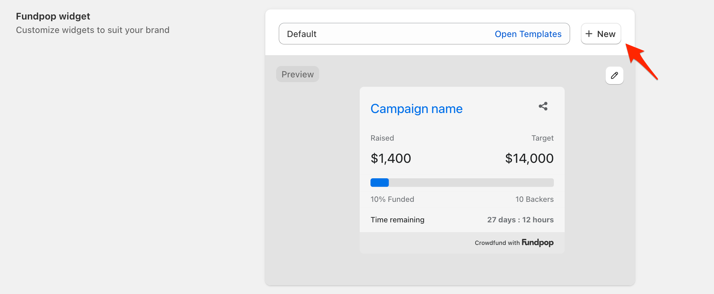
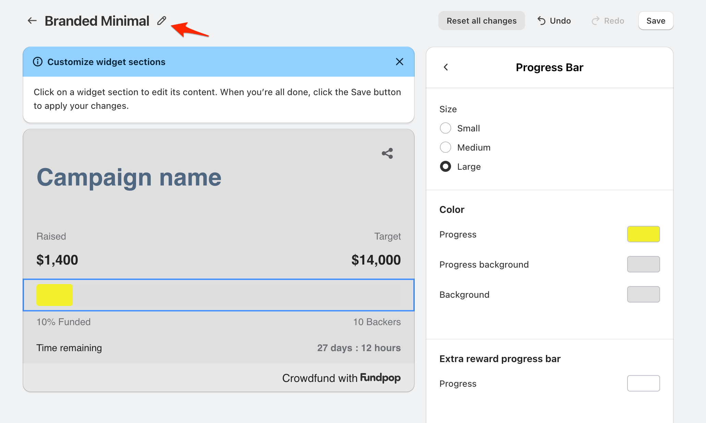

# 🎨 Fundpop Widget Templates

### Accessing Widget Templates

You have three options to start customizing a widget:

1. Edit the default template
2. Modify an existing template
3. Create a new template from scratch

<figure><figcaption>
Choose between editing existing templates or creating a new one
</figcaption></figure>

### Creating a New Template

1. Click the "+ New" button next to the template selector
2. Enter a descriptive name for your template
   * Choose a name that helps you identify the template's purpose
   * This template can be reused across multiple campaigns

<figure><figcaption></figcaption></figure>

### Customizing Your Widget

The customization interface is divided into two main sections:

* Left side: Live widget preview
* Right side: Customization options

#### General Settings

The top of the customization panel contains overall widget settings:

1. Color
   * Content background: Adjust the widget's background color
2. Font
   * Choose from available font options
   * Default option uses your theme's font
3. Display Options
   * Show a custom text that appears when the campaign goal is reached
   * Show a divider between time left and the rest of the widget
   * Enable or Disable box shadow so the widget blends even more on your theme
   * Fundpop badge (removable with Pro/Premium plans)

#### Section-Specific Customization

To customize individual sections:

1. Click on any section in the widget preview on the left
   * Campaign name
   * Progress bar
   * Statistics
   * Time remaining
2. The right panel will update to show options specific to that section

### Saving Your Template

1. Review your customizations in the preview
2. Click "Save" to apply your changes
3. The template will now be available for selection in any campaign

### Important Notes

* Templates can be reused across multiple campaigns
* Each campaign can use a different template
* Fundpop badge removal requires Pro or Premium subscription
* Changes to a template will affect all campaigns using that template
* Some text labels can be changed or translated directly from the template

### Best Practices

* Create templates that match your brand colors and style
* Test your template with different campaign goals and progress levels
* Consider creating separate templates for different types of campaigns
* Preview your template on both desktop and mobile views
