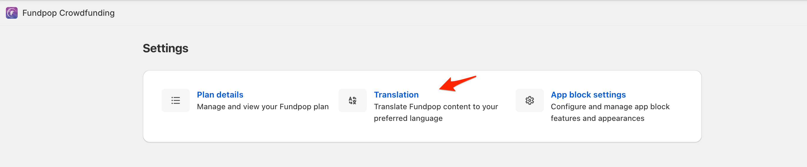
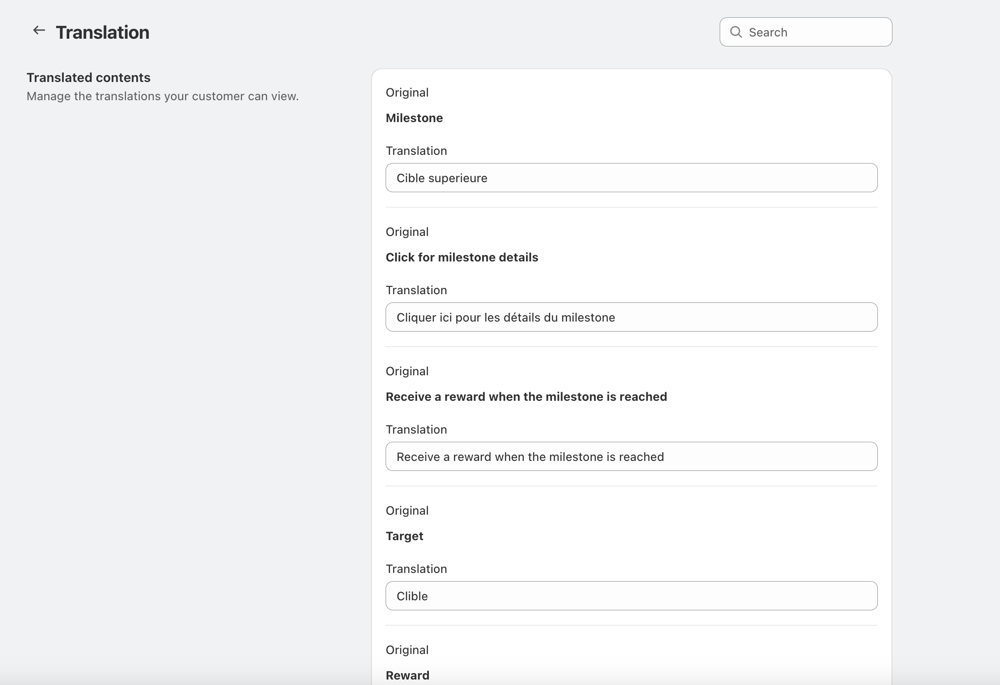

# ✍️ Translation

<figure><figcaption>
Translate Fundpop content to your preferred language
</figcaption></figure>

### Accessing Translation Settings

1. From your Fundpop menu, go to Settings
2. Click on the "Translation" option
3. You'll see the translation interface where you can manage customer-facing content

### Translatable Content

#### Campaign Elements

You can translate the following campaign components:

1. Milestones
   * Milestone titles
   * Milestone descriptions
   * Milestone details text
   * Reward information
2. Reward Tiers
   * Tier names
   * Tier descriptions
   * Bundle information
3. Campaign Time
   * Time remaining labels
   * Duration text
4. Pledge Information
   * Pledge-related text
   * Payment terms

<figure><figcaption>
Translation interface with a list of translatable content
</figcaption></figure>

#### Widget Template Text

Some text elements can be translated directly in the widget template editor:

* Progress indicators
* Statistical labels
* Button text
* Information tooltips

### Managing Translations

1. Navigate to the Translation section
2. You'll see a list of translatable content with:
   * Original text (in English)
   * Translation field for your target language
3. Enter your translations in the corresponding fields
4. Click save to apply the changes

### Best Practices

* Maintain consistent terminology across all translations
* Consider cultural differences when translating marketing content
* Review translations periodically, especially after adding new campaign features

### Important Notes

* All untranslated content will display in the original English
* Translations apply globally to all campaigns
* Special characters and accents are fully supported
