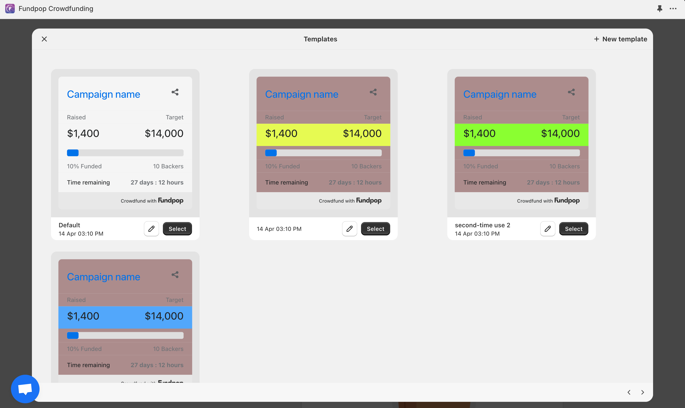

# 💰 Creating Your First Campaign

<figure><figcaption>
Fundpop app dashboard with "Create campaign" button
</figcaption></figure>

### Step 1: General

Start by giving your campaign a name:

* Click "Create campaign" in your Fundpop dashboard
* Enter a name for your campaign (50 character limit)
* This name will be displayed publicly on your store

<figure><figcaption>
Campaign name field in the General section, displaying a character counter
</figcaption></figure>

### Step 2: Fundpop Widget

The Fundpop widget is what displays your campaign's progress on your store:

1. Choose your widget template:
   * Default template is pre-selected
   * Click "Open Templates" to browse other options
   * Use "+ New" to create a custom template
2. Preview your widget on the right side:
   * See how campaign information will display
   * Check progress bar appearance
   * View backer count and time remaining layout

<figure><figcaption>
Widget section showing template selection and preview
</figcaption></figure>

3. Homepage Feature Option:


This option will be visible for saved campaigns only


* Find "Pin Fundpop widget on store homepage" below the preview
* Click "Pin campaign" to feature this campaign on your homepage
* Note: Only one campaign can be pinned at a time; pinning a new campaign will replace any previously pinned campaign

<figure><figcaption>
Pin your most important campaign to your store's homepage. This campaign will appear both on your product page and homepage - helpful tip: pin your most active campaign to maximize visibility
</figcaption></figure>

### Step 3: Campaign Products

Select products to feature in your campaign:

1. Click "Select products"
2. Choose products from your store:
   * Standard/Pro plans: Up to 5 products per campaign
   * Premium plan: Up to 25 products per campaign
3. Fundpop widget will appear on all selected product pages and each sales will contribute to the overall campaign progress

Note: At least one product must be selected to enable features like milestones and bundles.

<figure><figcaption>
Product selection interface
</figcaption></figure>

### Step 4: Campaign Goal

Set your funding target:

1. Choose your goal type:
   * Number of units: Track progress by quantity of products sold
   * Collected money: Set a monetary target
2. For collected money goals:
   * Enter your target amount
   * Optionally set initial funding
   * Add initial backer count if desired


### Initial Funding and backer count

When setting up your campaign goal, you have the option to add initial funding to your campaign. This feature allows you to account for:

* Contributions collected offline or through other channels
* Pre-campaign commitments from early supporters
* Funding secured before the official campaign launch
* Previous sales that should count toward your campaign total

**How Initial Funding Works:**

* The initial funding amount is added to your campaign progress from the moment it launches
* Progress bars and statistics will reflect this initial amount immediately
* Your campaign's success calculation includes this initial funding when determining if you've hit your goal


<figure><figcaption>
Campaign goal section displaying both options
</figcaption></figure>

### Step 5: Campaign Duration

Configure your campaign timeline:

1. Choose launch timing:
   * Launch now: Start immediately
   * Schedule launch time: Set future date/time
2. Set duration:
   * Use the slider to set campaign length
   * Enter specific number of days
   * Review exact start and end dates/times

<figure><figcaption>
 Duration section with calendar and slider
</figcaption></figure>

### Step 6: Order Options

Define how backers will support your campaign:

Select order method:

* **Order now**: Immediate purchase and payment
* **Pre-order**: Delayed payment collection

For pre-order campaigns, choose:

* **All-or-nothing**: Campaign products are canceled if goal is not met
  * Only crowdfunding products are canceled if the campaign fails. Other products in the same order remain active.
* **Flexible**: No orders are canceled regardless of goal

For pre-order campaigns, you can set:

* A pledge fee: This is a small commitment payment that backers pay during the campaign, while the full payment is collected later. It helps ensure backer commitment and reduces the risk of cancellations. Choose between:
  * Fixed amount (e.g., $5)
  * Percentage of product price (e.g., 10%)
* Full payment is collected on campaign success
* For all-or-nothing campaigns, pledge fees are refunded if the campaign fail

The pre-order selling plan name helps customers identify their purchase as a pre-order during checkout. For example, you might enter **Pre-order - Ships January 2026** or **Early Bird Special**.


#### Automatic Payment Processing

Fundpop automatically handles payments when campaigns end:

* **All-or-nothing campaigns**: Payments are automatically captured only if the campaign succeeds
* **Flexible campaigns**: Payments are automatically captured regardless of campaign success

This automation streamlines your post-campaign workflow and ensures timely payment processing. \
\
[⚠️](https://emojipedia.org/warning) After a campaign ends, we recommend consulting your Fundpop dashboard to verify payment processing status. Review your Orders section to confirm all payments were successfully captured and  identify any orders that may require manual attention or intervention.


<figure><figcaption>
 Order options section with pre-order settings
</figcaption></figure>

### Step 7: Advanced Features (Pro/Premium Only)

#### Campaign Milestones

Set intermediate targets to reward backers and build momentum during your campaign.

* Create milestones to incentivize early support
* Offer special rewards at different funding levels
* Note: Requires at least one campaign product

[Milestones documentation](../advanced-features/milestones.md) →

#### Reward Tiers

Create special bundles to offer unique perks for different contribution levels.

* Design tiered reward packages
* Bundle products with exclusive perks
* Note: Requires at least one campaign product

[Reward tiers documentation](../advanced-features/reward-tiers.md) →

### Finalizing Your Campaign

Before launching:

1. Review all settings
2. Click "Save" to create your campaign
3. Your campaign will start based on your selected timing

Your campaign will now be ready to launch according to your specified timeline. The next section will cover how to monitor and manage your active campaign.
