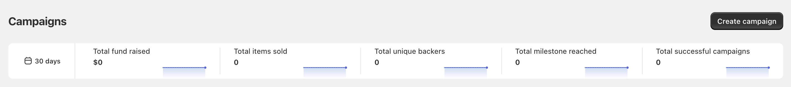
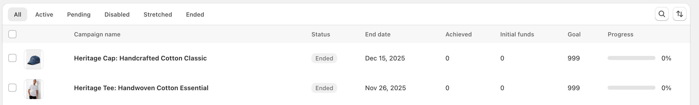
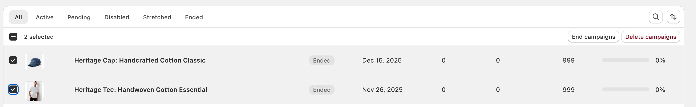

# 📈 Dashboard Overview

### Performance Metrics

At the top of your dashboard, you'll find important campaign statistics for your selected time period:

* **Total fund raised**: The sum of all contributions across your campaigns
* **Total items sold**: Number of products sold through your campaigns
* **Total unique backers**: Count of individual supporters
* **Total milestone reached**: Number of achieved campaign milestones
* **Total successful campaigns**: Count of campaigns that met their goals

You can adjust the time period (default: 30 days) to view metrics for different timeframes.

<figure><figcaption>
Dashboard's top section showing five key performance metrics that help you track your crowdfunding success at a glance. Use the time selector on the left to analyze different periods
</figcaption></figure>

### Campaign Management

#### Status Filters

Your campaigns are organized by their current status:

* **All**: View all campaigns regardless of status
* **Active**: Currently running campaigns
* **Pending**: Scheduled but not yet started
* **Disabled**: Temporarily paused campaigns
* **Stretched**: Campaigns continuing beyond their end date
* **Ended**: Completed campaigns

#### Campaign List View

Each campaign entry displays:

* Campaign name
* Product thumbnail
* Status indicator
* End date
* Amount achieved
* Initial funds
* Campaign goal
* Progress bar with percentage

<figure><figcaption>
Campaign list showing different statuses and detailed information for each campaign. Use the filters above the list to focus on specific campaign types
</figcaption></figure>

### Campaign Statuses

Understanding what each status means:

* **Active**: Campaign is live and accepting contributions
* **Pending**: Campaign is scheduled for a future start date
* **Disabled**: Campaign has been paused
* **Stretched**: Campaign continues beyond its original end date
* **Ended**: Campaign has completed its duration

### Quick Actions

From your dashboard, you can:

* Create a new campaign using the button in the top right
* Search for specific campaigns
* Sort and filter your campaign list
* Access individual campaign details by clicking on a campaign name

### Bulk Actions

You can perform actions on multiple campaigns simultaneously:

1. Select campaigns by clicking the checkbox next to each campaign
2. The number of selected campaigns will appear at the top of the list
3. Choose from available bulk actions:
   * **End campaigns**: Finish selected campaigns before their scheduled end date
   * **Delete campaigns**: Remove selected campaigns from your dashboard

<figure><figcaption>
Use bulk actions to efficiently manage multiple campaigns, but review your selection carefully before applying any action as these cannot be undone.
</figcaption></figure>
