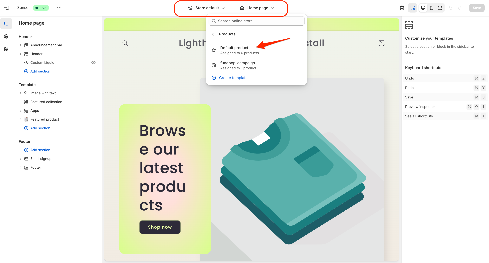

# 👋 Install Fundpop

## Method 1: Installing from the Onboarding Flow

1. After installing the app, you'll see a button to open the Shopify theme editor

<figure><figcaption>
Click “Open customization page” to jump straight into your Theme Editor
</figcaption></figure>

2. Click the button to open the theme editor in a new window - the Fundpop widget will automatically be added to your default product template

<figure><figcaption>
Select the Default product template, then drag the Fundpop block where you want it
</figcaption></figure>

3. In the editor, drag and drop the Fundpop block to your preferred position on the product page

* Recommended placement: underneath product title and price

4. Click save before closing the window
5. Return to the onboarding screen
6. Click the Continue button when you see the installation confirmation to begin setting up your first campaign

## Method 2: Installing Directly from Theme Editor

If you can't access the onboarding flow or prefer manual installation:

1. Go to your Shopify Admin → Online Store section

<figure><figcaption>
From Online Store → Themes, open the Theme Editor for the right theme
</figcaption></figure>

2. Select your theme and click Customize
3. Select the Default product template at the top of the theme editor

<figure><figcaption>
Switch to the Default product template to place the widget on PDPs
</figcaption></figure>

4. In the left sidebar, locate where you want to place the widget:

* Hover over the desired location
* Click the + icon between blocks
* Search for "Fundpop widget" in the apps section

<figure><figcaption>
Search “Fundpop” under Apps and add the Fundpop Widget to your page
</figcaption></figure>

5. Click save to complete the installation

### Note for Vintage Themes

If you're using an Online Store 1.0 / Vintage theme, contact our team for custom installation support:

* Via in-app chat
* Email: [support@fizzy.studio](mailto:support@fizzy.studio)

> [!TIP]
> See also: [Main Widget](../customizations/extended-widget-placement.md#main-widget) — overview of the standard Fundpop widget (layout, props, best practices).

